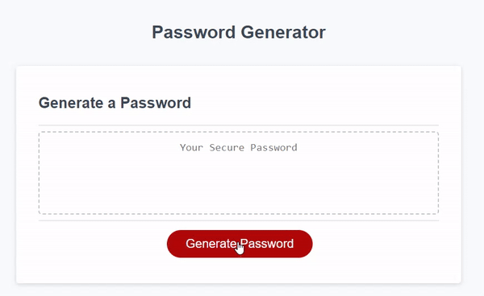

# Random Password Generator

## Description

This project is a simple yet powerful password generator application that allows users to create secure and customized passwords based on their specified criteria. The application ensures a strong level of password security by offering a variety of options for password length and character types.

## Usage

1. Open the HTML file in your preferred web browser.
2. Click the "Generate Password" button to initiate the password generation process.
3. Follow the prompts to specify the desired length and character types for your password.
4. Ensure at least one character type is selected.
5. View the generated password on the page, ready for use.

   https://eesahbella.github.io/password-generator/

## References

* HTML, CSS, and JavaScript All-In-One for Dummies (McFedries, P. (2023) ‘4 Building Dynamic Pages with JavaScript’, in HTML, CSS, & javascript: All-in-one. Hoboken, NJ: John Wiley & Sons, Inc. )
* https://www.w3schools.com/js/default.asp
* https://www.freecodecamp.org/news/tag/javascript/
* Xpert Learning Assistant
* https://www.youtube.com/watch?v=0n6hFpk62BI
* https://stackoverflow.com/questions/1497481/javascript-password-generator
* https://forum.codewithmosh.com/t/creating-a-password-generator-using-javascript/18971
* https://www.youtube.com/watch?v=v2jfGo7ztm8
